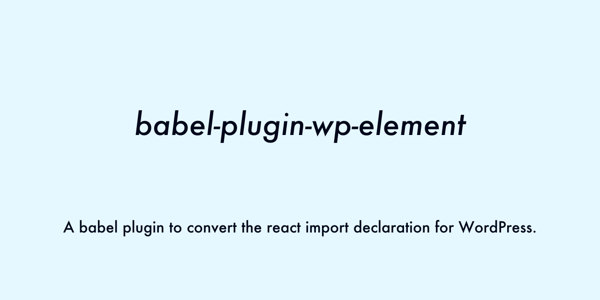

# babel-plugin-wp-element

[](https://travis-ci.org/kamataryo/babel-plugin-wp-element)



A babel plugin to convert the react import declaration for WordPress.

## Usage

```shell
$ yarn add babel-plugin-wp-element --dev
$ vi .babelrc

{
  plugins: ['wp-element']
}
```

## Development

```shell
$ git clone git@github.com:kamataryo/babel-plugin-wp-element.git
$ cd babel-plugin-wp-element
$ yarn
$ npm test
$ npm run Build
$ npm run e2e
```
